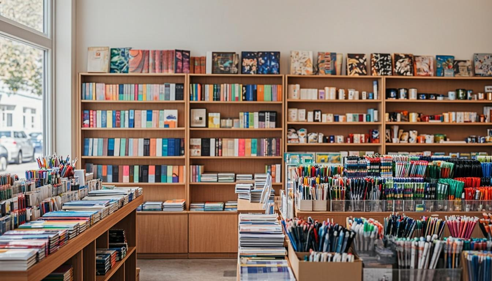

# Explicação Completa do Código — Empório do Papel

Este documento contém a explicação detalhada de todo o código HTML e CSS do site da papelaria **Empório do Papel**. O projeto foi construído usando apenas HTML e CSS (sem JavaScript), organizado em múltiplas páginas e arquivos CSS separados.

---

## Estrutura de Pastas

```
emporio-do-papel/
├── index.html              → Página inicial (Hero + Estatísticas)
├── CSS/
│   ├── global.css          → Variáveis, reset, estilos base, botões
│   ├── header.css          → Barra de navegação fixa
│   ├── hero.css            → Banner principal da home
│   ├── stats.css           → Seção de números/estatísticas
│   ├── sobre.css           → Página Sobre
│   ├── servicos.css        → Página Serviços + Equipe
│   ├── marketplace.css     → Página Marketplace (produtos)
│   ├── impressoes.css      → Página Tabela de Preços de Impressão
│   ├── contatos.css        → Página Contato + Localização + WhatsApp
│   ├── footer.css          → Rodapé (presente em todas as páginas)
│   └── responsive.css      → Media queries (responsivo para tablet/mobile)
├── pages/
│   ├── sobre.html          → Página Sobre
│   ├── servicos.html       → Página Serviços + Equipe
│   ├── marketplace.html    → Página Marketplace
│   ├── impressoes.html     → Página Impressões
│   └── contatos.html       → Página Contato
└── images/
    ├── hero-stationery.png       → Imagem do banner principal
    ├── about-supplies.png        → Imagem da seção Sobre
    ├── printing-service.png      → Imagem do serviço de impressão
    ├── product-school-kit.png    → Imagem do Kit Escolar
    ├── product-notebooks.png     → Imagem de Cadernos/Encadernação
    ├── product-pens.png          → Imagem de Canetas/Marca-textos
    ├── product-art.png           → Imagem de Materiais de Arte/Aquarela
    ├── product-paper.png         → Imagem de Papel A4
    ├── team-stationery.png       → Imagem dos membros da equipe
    └── location-map.png          → Imagem do mapa/localização
```

---

## Páginas HTML — Explicação

### index.html (Página Inicial)

```html
<!DOCTYPE html>
<!-- Declara que o documento usa HTML5 -->

<html lang="pt-BR">
<!-- lang="pt-BR" define o idioma como Português do Brasil, importante para acessibilidade e SEO -->

<head>
    <meta charset="UTF-8">
    <!-- Define a codificação de caracteres como UTF-8, permitindo acentos (á, é, ç, etc.) -->

    <meta name="viewport" content="width=device-width, initial-scale=1.0">
    <!-- Torna a página responsiva: a largura se adapta à tela do dispositivo -->

    <title>Empório do Papel - Papelaria & Materiais Escolares</title>
    <!-- Título que aparece na aba do navegador e nos resultados do Google -->

    <link rel="stylesheet" href="CSS/global.css">
    <!-- Conecta o CSS global (variáveis de cores, reset, botões) -->

    <link rel="stylesheet" href="CSS/header.css">
    <!-- Conecta o CSS do header (barra de navegação) -->

    <link rel="stylesheet" href="CSS/hero.css">
    <!-- Conecta o CSS da seção hero (banner principal) -->

    <link rel="stylesheet" href="CSS/stats.css">
    <!-- Conecta o CSS da seção de estatísticas -->

    <link rel="stylesheet" href="CSS/footer.css">
    <!-- Conecta o CSS do rodapé -->

    <link rel="stylesheet" href="CSS/responsive.css">
    <!-- Conecta o CSS responsivo (adaptação para telas menores) -->

    <link href="https://fonts.googleapis.com/css2?family=Playfair+Display:wght@400;600;700&family=Open+Sans:wght@300;400;600;700&display=swap" rel="stylesheet">
    <!-- Importa do Google Fonts:
         - Playfair Display: fonte serifada elegante, usada em títulos (pesos 400, 600, 700)
         - Open Sans: fonte sem serifa limpa, usada no corpo do texto (pesos 300, 400, 600, 700) -->
</head>

<body>
    <!-- ============ HEADER ============ -->
    <header class="header">
        <!-- Tag semântica para o cabeçalho. A classe .header é estilizada no header.css -->

        <div class="container header-inner">
            <!-- .container: centraliza o conteúdo (max-width: 1200px, margin: 0 auto) -->
            <!-- .header-inner: usa flexbox para alinhar logo + navegação + busca -->

            <div class="logo">
                <!-- Agrupa o ícone e o nome da marca -->
                <span class="logo-icon">&#9998;</span>
                <!-- &#9998; é uma entidade HTML que renderiza um ícone de caneta ✎ -->

                <span class="logo-text">Empório<span class="logo-highlight">do Papel</span></span>
                <!-- "Empório" aparece em branco, "do Papel" aparece em azul claro (classe .logo-highlight) -->
            </div>

            <nav class="nav">
                <!-- Tag semântica para navegação. Os links apontam para as páginas separadas -->
                <a href="index.html">Início</a>
                <!-- href aponta para a página inicial (nível raiz) -->
                <a href="pages/sobre.html">Sobre</a>
                <!-- href aponta para pages/sobre.html (subpasta pages/) -->
                <a href="pages/servicos.html">Serviços</a>
                <a href="pages/marketplace.html">Marketplace</a>
                <a href="pages/impressoes.html">Impressões</a>
                <a href="pages/contatos.html">Contato</a>
            </nav>

            <div class="header-search">
                <!-- Barra de busca visual (não funcional pois não há JavaScript) -->
                <input type="text" placeholder="Buscar produtos..." class="search-input">
                <!-- Campo de texto com texto placeholder -->
                <button class="search-btn">Buscar</button>
                <!-- Botão estilizado em azul -->
            </div>

            <a href="index.html" class="mobile-menu-btn">&#9776;</a>
            <!-- Ícone hamburger ☰ (entidade HTML &#9776;). No CSS, aparece apenas no mobile (display: none no desktop, display: block abaixo de 768px) -->
        </div>
    </header>

    <!-- ============ HERO SECTION ============ -->
    <section id="inicio" class="hero">
        <!-- id="inicio" pode ser usado como âncora. .hero aplica fundo bege claro -->

        <div class="container hero-inner">
            <!-- .hero-inner: flexbox com texto à esquerda e imagem à direita -->

            <div class="hero-content">
                <!-- Lado esquerdo: textos e botões CTA -->
                <h1>Tudo para seus estudos e trabalho criativo</h1>
                <!-- Título principal: fonte Playfair Display, 2.8rem, cor marrom escuro -->

                <p>Na Empório do Papel você encontra a maior variedade...</p>
                <!-- Descrição com fonte Open Sans, 1.1rem -->

                <div class="hero-buttons">
                    <!-- Container flex para os dois botões lado a lado -->
                    <a href="pages/marketplace.html" class="btn btn-primary">Ver Produtos</a>
                    <!-- Botão azul sólido (.btn-primary: fundo #3A7CA5) -->

                    <a href="pages/sobre.html" class="btn btn-outline">Saiba Mais</a>
                    <!-- Botão com borda azul (.btn-outline: fundo transparente, borda azul) -->
                </div>
            </div>

            <div class="hero-image">
                <!-- Lado direito: imagem com bordas arredondadas e sombra -->
                
                <!-- Imagem gerada por IA mostrando o interior de uma papelaria -->
            </div>
        </div>
    </section>

    <!-- ============ STATS SECTION ============ -->
    <section class="stats">
        <!-- Fundo azul escuro (#2C5F7C) para destaque visual -->

        <div class="container stats-inner">
            <!-- .stats-inner: flexbox com space-around para distribuir 3 itens -->

            <div class="stat-item">
                <span class="stat-number">+15.000</span>
                <!-- Número grande: Playfair Display, 2.8rem, cor bege -->

                <span class="stat-label">Clientes Satisfeitos</span>
                <!-- Label menor: cor azul claro -->
            </div>
            <div class="stat-item">
                <span class="stat-number">+3.500</span>
                <span class="stat-label">Produtos no Estoque</span>
            </div>
            <div class="stat-item">
                <span class="stat-number">+14</span>
                <span class="stat-label">Anos de Experiência</span>
            </div>
        </div>
    </section>

    <!-- ============ FOOTER ============ -->
    <footer class="footer">
        <!-- Fundo marrom escuro (#3E2723) -->

        <div class="container">
            <div class="footer-grid">
                <!-- Grid de 4 colunas (1.5fr 1fr 1fr 1fr): marca, navegação, contato, endereço -->

                <div class="footer-col">
                    <div class="footer-logo">
                        <span class="logo-icon">&#9998;</span>
                        <span class="logo-text">Empório<span class="logo-highlight">do Papel</span></span>
                    </div>
                    <p>Sua papelaria de confiança desde 2010...</p>
                    <div class="social-icons">
                        <!-- Links de redes sociais: círculos marrom que ficam azul no hover -->
                        <a href="#" class="social-icon" aria-label="Facebook">f</a>
                        <!-- aria-label: texto para leitores de tela (acessibilidade) -->
                        <a href="#" class="social-icon" aria-label="Instagram">in</a>
                        <a href="#" class="social-icon" aria-label="WhatsApp">W</a>
                    </div>
                </div>

                <div class="footer-col">
                    <h4>Navegação</h4>
                    <!-- h4: fonte Playfair Display, cor bege claro -->
                    <ul>
                        <li><a href="index.html">Início</a></li>
                        <li><a href="pages/sobre.html">Sobre Nós</a></li>
                        <li><a href="pages/servicos.html">Serviços</a></li>
                        <li><a href="pages/marketplace.html">Marketplace</a></li>
                        <li><a href="pages/impressoes.html">Impressões</a></li>
                    </ul>
                </div>

                <div class="footer-col">
                    <h4>Contato</h4>
                    <ul>
                        <li>(92) 8420-6201</li>
                        <li>contato@emporiodopapel.com.br</li>
                        <li>Seg - Sex: 8h às 18h</li>
                        <li>Sáb: 8h às 13h</li>
                    </ul>
                </div>

                <div class="footer-col">
                    <h4>Endereço</h4>
                    <p>Avenida Djalma Batista, 482 <br>Parque 10 de Novembro - Manaus/AM<br>CEP: 69050-92</p>
                    <!-- <br> quebra de linha dentro do parágrafo -->
                    <a href="#" class="btn btn-small btn-outline-light">Ver no Mapa</a>
                    <!-- Botão pequeno com borda bege (.btn-outline-light) -->
                </div>
            </div>

            <div class="footer-bottom">
                <!-- Linha separadora + copyright -->
                <p>&copy; 2026 Empório do Papel. Todos os direitos reservados.</p>
                <!-- &copy; renderiza o símbolo © -->
            </div>
        </div>
    </footer>
</body>
</html>
```

---

### pages/sobre.html (Página Sobre)

```html
<!DOCTYPE html>
<html lang="pt-BR">
<head>
    <meta charset="UTF-8">
    <meta name="viewport" content="width=device-width, initial-scale=1.0">
    <title>Sobre - Empório do Papel</title>

    <!-- CSS paths usam ../ para voltar um nível (de pages/ para a raiz) -->
    <link rel="stylesheet" href="../CSS/global.css">
    <link rel="stylesheet" href="../CSS/header.css">
    <link rel="stylesheet" href="../CSS/sobre.css">
    <link rel="stylesheet" href="../CSS/footer.css">
    <link rel="stylesheet" href="../CSS/responsive.css">

    <link href="https://fonts.googleapis.com/css2?family=Playfair+Display:wght@400;600;700&family=Open+Sans:wght@300;400;600;700&display=swap" rel="stylesheet">
</head>
<body>
    <header class="header">
        <div class="container header-inner">
            <div class="logo">
                <span class="logo-icon">&#9998;</span>
                <span class="logo-text">Empório<span class="logo-highlight">do Papel</span></span>
            </div>
            <nav class="nav">
                <!-- Links de navegação usam caminhos relativos: ../ para raiz, nome direto para mesma pasta -->
                <a href="../index.html">Início</a>
                <a href="sobre.html">Sobre</a>
                <!-- sobre.html está na mesma pasta pages/, sem necessidade de ../ -->
                <a href="servicos.html">Serviços</a>
                <a href="marketplace.html">Marketplace</a>
                <a href="impressoes.html">Impressões</a>
                <a href="contatos.html">Contato</a>
            </nav>
            <div class="header-search">
                <input type="text" placeholder="Buscar produtos..." class="search-input">
                <button class="search-btn">Buscar</button>
            </div>
            <a href="../index.html" class="mobile-menu-btn">&#9776;</a>
        </div>
    </header>

    <section id="sobre" class="about">
        <!-- .about: fundo branco, padding de 80px em cima e abaixo -->

        <div class="container about-inner">
            <!-- .about-inner: flexbox com texto à esquerda, imagem à direita -->

            <div class="about-text">
                <h2>Sua papelaria de confiança desde 2010</h2>
                <!-- h2: 2.2rem, cor marrom escuro, fonte Playfair Display -->

                <p>Há mais de uma década, a Empório do Papel é referência...</p>
                <p>Contamos com um estoque completo...</p>

                <a href="marketplace.html" class="btn btn-secondary">Ver Catálogo</a>
                <!-- .btn-secondary: fundo marrom médio (#8B5E3C) -->
            </div>

            <div class="about-image">
                <!-- Imagem com bordas arredondadas e sombra -->
                
                <!-- src usa ../images/ para voltar um nível e acessar a pasta images/ -->
            </div>
        </div>
    </section>

    <!-- Footer igual ao da index.html, mas com links relativos à pasta pages/ -->
    <footer class="footer">
        ...mesma estrutura, com href="../index.html" para Início e href="sobre.html" etc. para páginas na mesma pasta...
    </footer>
</body>
</html>
```

---

### pages/servicos.html (Página Serviços + Equipe)

Contém duas seções principais:

1. **Seção Serviços** — Grid de 3 cards (CSS Grid: `repeat(3, 1fr)`) com serviços de Impressão & Copiagem, Encadernação e Materiais de Arte. Cada card tem:
   - `.service-image`: imagem com 220px de altura, overflow hidden
   - `.service-info`: padding 24px, título h3, descrição p, preço `.service-price` e botão
   - Hover: card sobe 6px e ganha sombra mais forte

2. **Seção Equipe** — Grid de 3 cards centralizados com:
   - `.team-photo`: imagem circular (120x120px, border-radius: 50%, borda azul)
   - Nome do membro (h3) e cargo (span em azul #3A7CA5)
   - Membros: Lucas Ian Izel da Silva (Atendimento & Vendas), Adrya Sophia Bargas de Souza (Impressões & Encadernação), Morgana de Souza Santiago Pacífico (Consultora de Arte)

---

### pages/marketplace.html (Página Marketplace)

Grid de 6 produtos em 3 colunas. Cada produto tem:
- `.product-image`: imagem com 260px de altura, position relative (para posicionar o badge)
- `.product-badge`: etiqueta position absolute no canto superior esquerdo ("Mais Vendido" ou "Novo")
- `.product-info`: padding 24px, título h3, descrição p, preço `.price-current` (azul escuro, 1.3rem, bold) e `.price-old` (cinza, riscado)
- Botão "Comprar" (`.btn-primary.btn-full`: ocupa 100% da largura)

Produtos: Kit Escolar Completo (R$ 49,90), Kit Canetas Premium (R$ 24,90), Cadernos Premium 10 Un. (R$ 39,90), Kit Aquarela Profissional (R$ 89,90), Resma Papel A4 (R$ 34,90), Marca-textos Neon 6 Un. (R$ 18,90)

---

### pages/impressoes.html (Página Impressões)

Layout flex com imagem à esquerda (sticky) e conteúdo à direita:
- `.printing-image`: position sticky, top 90px (gruda no topo ao rolar)
- Duas tabelas de preço lado a lado (grid 2 colunas):
  - Impressão Preto & Branco (A4 R$0,25, A3 R$0,50, Ofício R$0,30, Carta R$0,25)
  - Impressão Colorida (A4 R$1,00, A3 R$2,00, Ofício R$1,20, Foto 10x15 R$2,50)
- Serviços adicionais: grid de 2 colunas com itens (Encadernação Espiral R$8, Capa Dura R$25, Plastificação A4 R$5, A3 R$8, Digitalização R$2, Banner R$35/m)

---

### pages/contatos.html (Página Contato)

Três seções:

1. **Contato** — Grid de 2 colunas:
   - Formulário (inputs: nome, email, assunto, textarea mensagem + botão enviar)
   - Cards de informação: Telefone (92) 8420-6201, E-mail contato@emporiodopapel.com.br, Horário (Seg-Sex 8h-18h, Sáb 8h-13h), Endereço Av. Djalma Batista 482

2. **Localização** — Flexbox com texto à esquerda e imagem do mapa à direita

3. **WhatsApp CTA** — Fundo azul (#3A7CA5) com botão verde WhatsApp que linka para https://wa.me/559284206201

---

## Arquivos CSS — Explicação

### CSS/global.css — Estilos Globais

```css
:root {
    /* VARIÁVEIS DE CORES (CSS Custom Properties)
       Definidas no :root (elemento <html>), podem ser usadas em qualquer lugar com var(--nome).
       Facilita mudar cores depois — basta alterar aqui. */

    --bege-100: #FAF6F0;   /* Bege mais claro — fundos sutis */
    --bege-200: #F5EDE0;   /* Bege claro — fundo de seções alternadas */
    --bege-300: #E8DFD0;   /* Bege médio — bordas e detalhes */
    --bege-400: #D4C9B8;   /* Bege escuro — placeholders de input */
    --bege-500: #C4B69E;   /* Bege mais escuro — texto secundário no footer */

    --azul-100: #E8F1F8;   /* Azul mais claro — fundo de cabeçalho de tabela */
    --azul-200: #B8D4E8;   /* Azul claro — labels de estatísticas */
    --azul-300: #6EAAD4;   /* Azul médio — destaque do logo, bordas */
    --azul-400: #3A7CA5;   /* Azul principal — botões, ícones, preços */
    --azul-500: #2C5F7C;   /* Azul escuro — hover de botões, fundo de stats */
    --azul-600: #1E3A4F;   /* Azul mais escuro — reservado */

    --marrom-300: #8B5E3C; /* Marrom médio — botões secondary, badges */
    --marrom-400: #6B4226; /* Marrom escuro — fundo de input no header */
    --marrom-500: #5C3D2E; /* Marrom mais escuro — títulos h3 */
    --marrom-600: #3E2723; /* Marrom mais escuro — header, footer, títulos h1/h2 */

    --white: #FFFFFF;      /* Branco puro */
    --gray-500: #ADB5BD;   /* Cinza médio — preço antigo riscado */
    --gray-700: #495057;   /* Cinza escuro — cor principal dos textos */

    --shadow-sm: ...;      /* Sombra leve — cards em repouso */
    --shadow-md: ...;      /* Sombra média — hover e header */
    --shadow-lg: ...;      /* Sombra forte — hero e hover de cards */

    --radius-sm: 6px;      /* Arredondamento pequeno — inputs */
    --radius-md: 10px;     /* Arredondamento médio — cards, tabelas */
    --radius-lg: 16px;     /* Arredondamento grande — imagens */
    --radius-full: 50px;   /* Arredondamento total — botões, badges, fotos */

    --transition: all 0.3s ease; /* Transição suave de 0.3s aplicada em hovers */
}

*, *::before, *::after {
    margin: 0;           /* Remove margem padrão do navegador */
    padding: 0;          /* Remove padding padrão do navegador */
    box-sizing: border-box; /* Padding e border entram DENTRO da largura definida */
}

html {
    scroll-behavior: smooth; /* Rola suavemente ao clicar em links âncora (#) */
}

body {
    font-family: 'Open Sans', sans-serif; /* Fonte do corpo — limpa e legível */
    color: var(--gray-700);               /* Cor padrão do texto: cinza escuro */
    background-color: var(--white);       /* Fundo branco */
    line-height: 1.7;                     /* Espaçamento entre linhas: 1.7x */
    overflow-x: hidden;                   /* Esconde barra de rolagem horizontal */
}

h1, h2, h3, h4 {
    font-family: 'Playfair Display', serif; /* Fonte dos títulos — elegante com serifa */
    color: var(--marrom-600);               /* Cor: marrom escuro */
    line-height: 1.3;                       /* Espaçamento menor para títulos */
}

img {
    max-width: 100%;  /* Nunca ultrapassa a largura do container */
    height: auto;     /* Altura se ajusta para manter proporção */
    display: block;   /* Remove espaço em branco abaixo de imagens */
}

a {
    text-decoration: none; /* Remove sublinhado dos links */
    color: inherit;        /* Links herdam a cor do elemento pai */
}

ul {
    list-style: none; /* Remove marcadores (bolinhas) das listas */
}

.container {
    max-width: 1200px; /* Largura máxima do conteúdo */
    margin: 0 auto;    /* Centraliza horizontalmente */
    padding: 0 20px;   /* Espaçamento lateral para não colar nas bordas */
}

/* BOTÕES — Todos seguem o padrão base .btn e ganham variações com classes extras */
.btn {
    display: inline-block;          /* Permite definir largura/altura */
    padding: 14px 32px;             /* Espaçamento interno */
    border-radius: var(--radius-full); /* Bordas totalmente arredondadas (pílula) */
    font-weight: 600;               /* Semi-negrito */
    cursor: pointer;                /* Cursor de mãozinha */
    transition: var(--transition);  /* Transição suave em hovers */
    border: 2px solid transparent;  /* Borda invisível (evita pulo ao adicionar borda) */
}

.btn-primary { /* Botão azul — CTAs principais */
    background-color: var(--azul-400);
    color: var(--white);
}
.btn-primary:hover { /* Azul escurece, sobe 2px, ganha sombra */
    background-color: var(--azul-500);
    transform: translateY(-2px);
    box-shadow: var(--shadow-md);
}

.btn-secondary { /* Botão marrom — ações alternativas */
    background-color: var(--marrom-300);
    color: var(--white);
}

.btn-outline { /* Só borda azul, sem fundo — botão "Saiba Mais" */
    background: transparent;
    color: var(--azul-400);
    border-color: var(--azul-400);
}
.btn-outline:hover { /* Fundo fica azul, texto fica branco */
    background-color: var(--azul-400);
    color: var(--white);
}

.btn-outline-light { /* Borda bege — botão "Ver no Mapa" no footer */
    background: transparent;
    color: var(--bege-300);
    border-color: var(--bege-300);
    padding: 10px 24px; /* Menor que o padrão */
}

.btn-small { padding: 10px 24px; font-size: 0.85rem; } /* Botão menor */
.btn-full { width: 100%; } /* Ocupa toda a largura */

.btn-whatsapp { /* Verde oficial do WhatsApp */
    background-color: #25D366;
    padding: 16px 40px; /* Maior para destaque */
}

.section-header { /* Título + subtítulo centralizados — reutilizado em várias seções */
    text-align: center;
    margin-bottom: 50px;
}
.section-header p {
    max-width: 600px; /* Limita largura para melhor legibilidade */
    margin: 0 auto;   /* Centraliza */
}
```

---

### CSS/header.css — Barra de Navegação

```css
.header {
    background-color: var(--marrom-600); /* Fundo marrom escuro */
    position: sticky;  /* Fica grudado no topo ao rolar */
    top: 0;
    z-index: 1000;     /* Fica acima de todos os elementos */
    box-shadow: var(--shadow-md);
}

.header-inner {
    display: flex;                 /* Logo + Nav + Busca em linha */
    align-items: center;           /* Centraliza verticalmente */
    justify-content: space-between; /* Espaça igualmente */
    height: 70px;
}

.logo { display: flex; align-items: center; gap: 8px; }
.logo-icon { font-size: 1.8rem; color: var(--bege-300); } /* Ícone de caneta ✎ */
.logo-text { font-family: 'Playfair Display'; font-weight: 700; color: var(--white); }
.logo-highlight { color: var(--azul-300); } /* "do Papel" em azul claro */

.nav { display: flex; gap: 28px; }
.nav a {
    color: var(--bege-200);
    position: relative; /* Necessário para o ::after (sublinhado animado) */
}
.nav a::after {
    /* Pseudo-elemento que cria sublinhado animado ao hover */
    content: '';          /* Linha invisível */
    position: absolute;
    bottom: -4px;
    width: 0;             /* Invisível por padrão */
    height: 2px;
    background-color: var(--azul-300);
    transition: var(--transition);
}
.nav a:hover::after { width: 100%; } /* Sublinhado cresce ao hover */

.header-search { display: flex; gap: 0; } /* Input e botão colados */
.search-input {
    border-radius: ... 0 0 ...; /* Arredondado só à esquerda */
    background-color: var(--marrom-400); /* Fundo marrom mais escuro */
    width: 180px;
}
.search-btn {
    border-radius: 0 ... ... 0; /* Arredondado só à direita */
    background-color: var(--azul-400);
}

.mobile-menu-btn {
    display: none; /* Escondido no desktop, aparece no mobile */
}
```

---

### CSS/hero.css — Banner Principal

```css
.hero {
    background-color: var(--bege-200); /* Fundo bege claro */
    padding: 80px 0;
}
.hero-inner { display: flex; gap: 60px; align-items: center; }
.hero-content { flex: 1; } /* Ocupa metade do espaço */
.hero-content h1 { font-size: 2.8rem; } /* Título grande: 44.8px */
.hero-buttons { display: flex; gap: 16px; } /* Botões lado a lado */
.hero-image { flex: 1; border-radius: var(--radius-lg); overflow: hidden; box-shadow: var(--shadow-lg); }
.hero-image img { height: 400px; object-fit: cover; } /* Preenche sem distorcer */
```

---

### CSS/stats.css — Estatísticas

```css
.stats { background-color: var(--azul-500); padding: 60px 0; } /* Fundo azul escuro */
.stats-inner { display: flex; justify-content: space-around; text-align: center; }
.stat-number { font-family: 'Playfair Display'; font-size: 2.8rem; color: var(--bege-300); } /* Número grande bege */
.stat-label { color: var(--azul-200); } /* Label azul claro */
```

---

### CSS/sobre.css — Página Sobre

```css
.about { padding: 80px 0; background-color: var(--white); }
.about-inner { display: flex; align-items: center; gap: 60px; }
.about-text { flex: 1; }
.about-text h2 { font-size: 2.2rem; }
.about-image { flex: 1; border-radius: var(--radius-lg); overflow: hidden; }
.about-image img { height: 380px; object-fit: cover; }
```

---

### CSS/servicos.css — Serviços + Equipe

```css
.services { padding: 80px 0; }
.services-grid { display: grid; grid-template-columns: repeat(3, 1fr); gap: 30px; } /* 3 colunas */

.service-card {
    border-radius: var(--radius-lg);
    box-shadow: var(--shadow-sm);
    border: 1px solid var(--bege-300);
    transition: var(--transition);
}
.service-card:hover { transform: translateY(-6px); box-shadow: var(--shadow-lg); } /* Sobe 6px */
.service-image { height: 220px; overflow: hidden; }
.service-card:hover .service-image img { transform: scale(1.05); } /* Imagem aumenta 5% */
.service-info { padding: 24px; }
.service-price { color: var(--azul-400); font-weight: 700; } /* Preço em azul */

.team { padding: 80px 0; background-color: var(--bege-200); } /* Fundo bege alternado */
.team-grid { display: grid; grid-template-columns: repeat(3, 1fr); justify-items: center; }
.team-card { text-align: center; max-width: 300px; padding: 32px 24px; }
.team-photo { width: 120px; height: 120px; border-radius: 50%; border: 4px solid var(--azul-200); } /* Foto circular com borda azul */
.team-card span { color: var(--azul-400); } /* Cargo em azul */
```

---

### CSS/marketplace.css — Marketplace

```css
.marketplace { padding: 80px 0; }
.products-grid { display: grid; grid-template-columns: repeat(3, 1fr); gap: 30px; } /* 3 produtos por linha */

.product-card { border: 1px solid var(--bege-300); transition: var(--transition); }
.product-card:hover { transform: translateY(-6px); box-shadow: var(--shadow-lg); }
.product-image { height: 260px; position: relative; } /* relative para posicionar o badge */
.product-card:hover .product-image img { transform: scale(1.05); }

.product-badge {
    position: absolute; top: 14px; left: 14px;
    background-color: var(--marrom-300); /* Fundo marrom */
    border-radius: var(--radius-full); /* Formato de pílula */
    text-transform: uppercase; /* MAIÚSCULAS */
}

.price-current { font-size: 1.3rem; font-weight: 700; color: var(--azul-500); } /* Preço em azul escuro */
.price-old { font-size: 0.9rem; color: var(--gray-500); text-decoration: line-through; } /* Riscado */
```

---

### CSS/impressoes.css — Tabela de Preços

```css
.printing { padding: 80px 0; background-color: var(--bege-100); }
.printing-inner { display: flex; gap: 60px; align-items: flex-start; } /* flex-start para sticky */

.printing-image {
    position: sticky; top: 90px; /* Imagem gruda no topo ao rolar (90px = 70px header + 20px margem) */
}
.printing-content { flex: 1.2; } /* Ocupa mais espaço que a imagem */

.printing-tables { display: grid; grid-template-columns: repeat(2, 1fr); gap: 24px; } /* 2 tabelas lado a lado */

.price-table { background: white; border-radius: var(--radius-md); overflow: hidden; }
.price-table h3 { background-color: var(--azul-500); color: white; text-align: center; padding: 14px; }
.price-table th { background-color: var(--azul-100); color: var(--azul-500); text-transform: uppercase; font-size: 0.8rem; }
.price-table td { border-bottom: 1px solid var(--bege-300); padding: 12px 14px; }

.extra-services { background: white; border-radius: var(--radius-md); padding: 24px; }
.extra-grid { display: grid; grid-template-columns: repeat(2, 1fr); gap: 12px; }
.extra-item { display: flex; justify-content: space-between; background-color: var(--bege-100); }
.extra-price { font-weight: 700; color: var(--azul-500); } /* Preço em azul escuro */
```

---

### CSS/contatos.css — Contato + Localização + WhatsApp

```css
.contact { padding: 80px 0; }
.contact-inner { display: grid; grid-template-columns: 1.2fr 1fr; gap: 50px; } /* Formulário mais largo */

.form-group input, .form-group textarea {
    width: 100%;
    border: 2px solid var(--bege-300);    /* Borda bege */
    background-color: var(--bege-100);     /* Fundo bege claríssimo */
    border-radius: var(--radius-md);
}
.form-group input:focus, .form-group textarea:focus {
    border-color: var(--azul-400);  /* Borda fica azul ao focar */
    background-color: var(--white); /* Fundo fica branco */
}

.info-card { display: flex; gap: 18px; background-color: var(--bege-100); }
.info-card:hover { transform: translateX(4px); } /* Desliza 4px à direita */
.info-icon { width: 50px; height: 50px; border-radius: 50%; background-color: var(--azul-400); } /* Círculo azul */

.location { background-color: var(--bege-200); }
.location-inner { display: flex; gap: 60px; align-items: center; }
.location-map img { height: 350px; object-fit: cover; border-radius: var(--radius-lg); }

.whatsapp-section { background-color: var(--azul-400); padding: 60px 0; } /* Fundo azul destaque */
.whatsapp-text h2 { color: var(--white); }
.whatsapp-text p { color: var(--azul-100); } /* Azul claríssimo */
```

---

### CSS/footer.css — Rodapé

```css
.footer { background-color: var(--marrom-600); padding: 60px 0 0; color: var(--bege-300); }
.footer-grid {
    display: grid;
    grid-template-columns: 1.5fr 1fr 1fr 1fr; /* Primeira coluna mais larga */
    border-bottom: 1px solid var(--marrom-400); /* Linha separadora */
}
.footer-col h4 { color: var(--bege-200); font-family: 'Playfair Display'; }
.footer-col ul li a { color: var(--bege-400); }
.footer-col ul li a:hover { color: var(--azul-300); } /* Links ficam azul ao hover */

.social-icon {
    width: 38px; height: 38px; border-radius: 50%;
    background-color: var(--marrom-400); color: var(--bege-300);
}
.social-icon:hover { background-color: var(--azul-400); color: var(--white); } /* Fica azul */

.footer-bottom { text-align: center; padding: 20px 0; }
.footer-bottom p { color: var(--bege-500); font-size: 0.85rem; } /* Texto discreto */
```

---

### CSS/responsive.css — Design Responsivo

```css
/* Tablet / Laptop pequeno (até 1024px) */
@media (max-width: 1024px) {
    .hero-content h1 { font-size: 2.2rem; } /* Título menor */
    .services-grid, .products-grid { grid-template-columns: repeat(2, 1fr); } /* 2 colunas */
    .printing-inner { flex-direction: column; } /* Imagem acima, conteúdo abaixo */
    .printing-image { position: static; } /* Desativa sticky no tablet */
    .footer-grid { grid-template-columns: repeat(2, 1fr); } /* Footer em 2 colunas */
}

/* Mobile / Tablet retrato (até 768px) */
@media (max-width: 768px) {
    .nav { display: none; } /* Esconde navegação horizontal */
    /* NOTA: Sem JavaScript, o menu hamburger não funciona — o .nav.active só seria ativado via JS */
    .header-search { display: none; } /* Esconde busca */
    .mobile-menu-btn { display: block; } /* Mostra hamburger */

    .hero-inner, .about-inner, .location-inner { flex-direction: column; } /* Tudo empilhado */
    .services-grid, .products-grid, .team-grid { grid-template-columns: 1fr; } /* 1 coluna */
    .printing-tables, .extra-grid, .contact-inner { grid-template-columns: 1fr; }
    .footer-grid { grid-template-columns: 1fr; }
    .hero-buttons { flex-direction: column; } /* Botões empilhados */
}

/* Celular pequeno (até 480px) */
@media (max-width: 480px) {
    .hero-content h1 { font-size: 1.7rem; } /* Título ainda menor */
    .section-header h2, .marketplace-header h2 { font-size: 1.7rem; }
    .container { padding: 0 16px; } /* Padding menor */
    .product-image { height: 200px; } /* Imagens menores */
}
```

---

## Observações Importantes

1. **Sem JavaScript**: O site é 100% HTML + CSS. O menu mobile (hamburger) não funciona interativamente porque exigiria JavaScript para alternar a classe `.nav.active`. Para torná-lo funcional, seria necessário adicionar JavaScript.

2. **Navegação multi-páginas**: Os links de navegação apontam para arquivos HTML reais (ex: `pages/sobre.html`), não para âncoras. As páginas dentro da pasta `pages/` usam `../` para acessar arquivos na raiz.

3. **Formulário de contato**: O formulário na página de contatos é visual apenas — sem `action` ou `method`, ele não envia dados. Para funcionalidade, seria necessário um backend ou serviço como Formspree.

4. **Imagens**: Todas as imagens foram geradas por IA e estão na pasta `images/`. As páginas dentro de `pages/` usam `../images/` para acessá-las.

5. **Paleta de cores**: Bege (#FAF6F0, #F5EDE0, #E8DFD0), Azul (#2C5F7C, #3A7CA5, #6EAAD4), Marrom (#3E2723, #5C3D2E, #8B5E3C).

6. **Fontes**: Playfair Display (títulos com serifa) + Open Sans (corpo sem serifa), importadas do Google Fonts.
